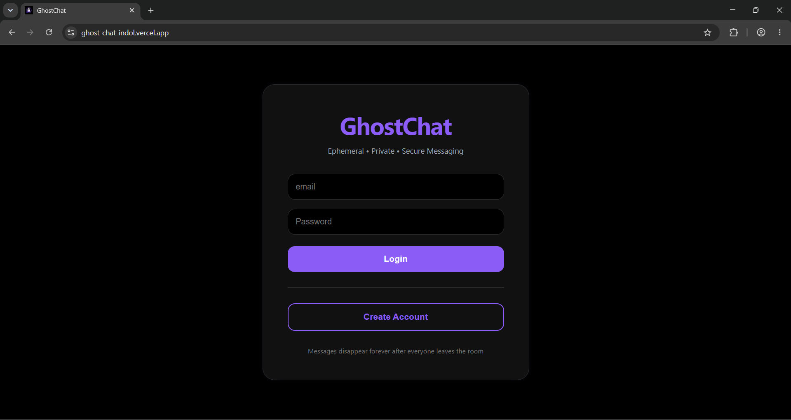
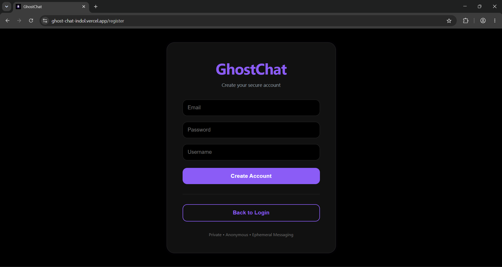
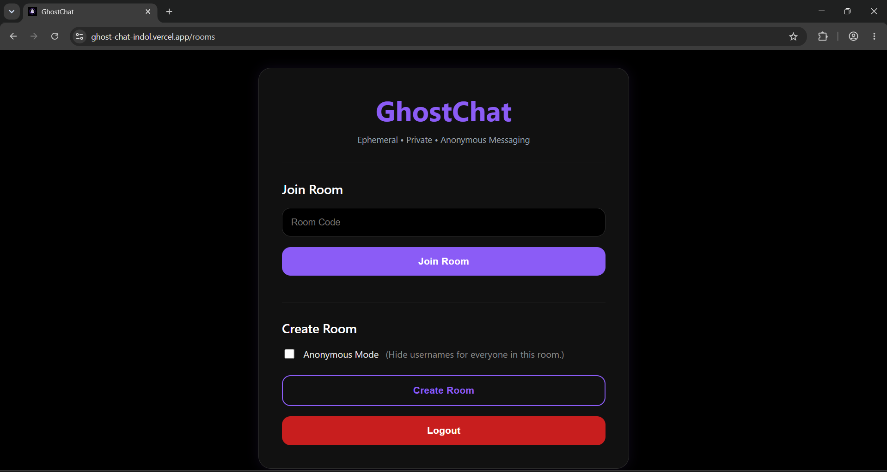
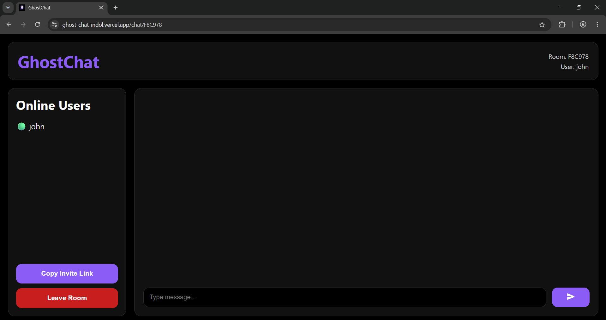
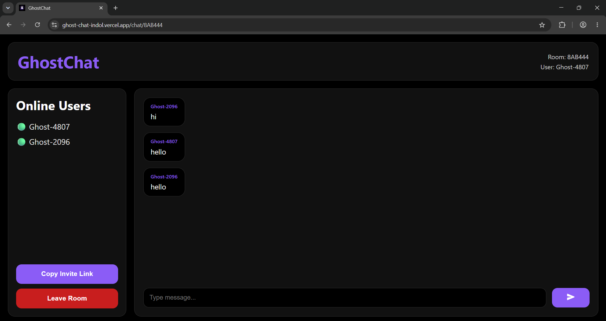
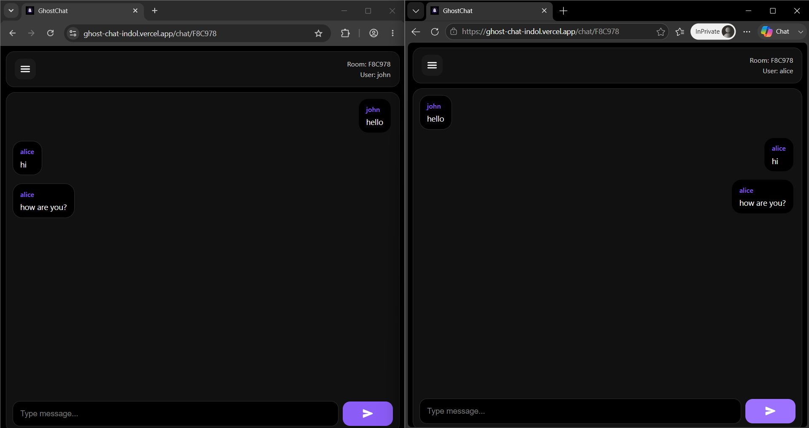

# 👻 GhostChat

A secure, real-time ephemeral chat application where messages automatically disappear after a configurable time. Built with **Spring Boot**, **React**, **WebSockets**, **JWT Authentication**, **Redis**, and **MySQL**.

## 🚀 Live Demo

**Frontend:** https://ghost-chat-indol.vercel.app

**Backend API:** https://ghostchat-f3sq.onrender.com

---

## ✨ Features

- 🔐 JWT Authentication
- 💬 Real-time messaging with WebSockets
- ⏳ Automatic message expiration
- 👤 Anonymous room mode
- 🔗 One-time invite links
- 🟢 Online user presence
- 🚪 Private chat rooms
- 📱 Responsive UI
- ⚡ Redis integration
- 🗄️ MySQL database

---

## 🛠️ Tech Stack

| Layer | Technology |
|-------|------------|
| Frontend | React, Vite, React Router, CSS |
| Backend | Spring Boot, Spring Security |
| Authentication | JWT |
| Real-time Communication | WebSocket (STOMP + SockJS) |
| Database | MySQL (TiDB Cloud) |
| Cache | Redis (Upstash) |
| Deployment | Vercel, Render |

---

## 🏗️ Architecture

```text
                React (Vite)
                     │
      REST APIs + WebSocket (STOMP)
                     │
               Spring Boot
              /            \
         MySQL          Redis
```

---

# 📸 Screenshots

## Login



---

## Register



---

## Room Dashboard



---

## Chat Room



---

## Anonymous Mode



---

## Chatting


## ⚙️ Running Locally

### Backend

```bash
cd ghostchat
./mvnw spring-boot:run
```

### Frontend

```bash
cd ghostchat-frontend
npm install
npm run dev
```

Frontend runs on:

```
http://localhost:5173
```

Backend runs on:

```
http://localhost:8080
```

---

## 🎯 Future Improvements

- 🔒 End-to-end encryption
- 📁 File sharing
- 🎤 Voice messages
- ✅ Read receipts
- 🔔 Push notifications
- 👥 Group chats
- 😊 Emoji reactions
- 📸 Image sharing
